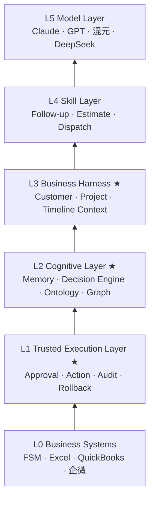

# 02 · 系统架构规格（FS-COS Architecture Specification v1.2）

> **Field Service Cognitive Operating System（FS-COS）**：运行在 Field Service FSM 之上的
> **认知与决策层**；Agent 为执行面。工程实现仍在 **fs-aol** 仓库。
>
> 本文是架构 SSOT，描述**目标形态**；当前 POC 只实现其中最薄的一条竖切
>（见 [PUB-03-roadmap.md](PUB-03-roadmap.md) Phase 1），各组件均标注 **POC 现状**。
> 愿景与战略修正见 [PUB-01-vision.md](PUB-01-vision.md)。

---

## 1. 系统定位（System Definition）

```text
Business Systems     FSM · Excel · 企微 …
Trusted Execution    审批 · 执行 · 审计 · 回滚
Cognitive Layer      认知 · 决策 · 本体 · 记忆
Business Harness     跨源上下文组装 → Project Context
Skill Layer          Follow-up · Estimate …（可替换）
Model Layer          混元 / DeepSeek / Claude …（可替换）
```

| 层 | 护城河 | 职责 |
|----|--------|------|
| Business Systems | — | 记录事实 |
| **Trusted Execution** | ★ | 建议→审批→执行→记录；企业责任边界 |
| **Cognitive** | ★ | 理解业务、决策「下一步做什么」 |
| **Business Harness** | ★ | 模型不知道的 FSM/表格/微信事实 → 统一上下文 |
| Skill / Model | — | 商品化趋势（Prompt/Workflow/Skill 可被平台原生化） |

> **FSM records what happened. Harness assembles context. Cognitive decides. Trusted Execution runs after approval.**

五层对照详见 [PUB-01-vision.md](PUB-01-vision.md) § 与《认知机器》五层对照。

**刻意不做**：与模型公司争 Runtime；把 Follow-up/Estimate **Skill** 当作平台终局。

---

## 2. 设计目标（Design Goals）

**2.1 业务目标**

- 提升 lead → close 转化率（通过**更好的决策**，而非更多自动化消息）
- 缩短报价与跟进响应时间
- 提高 follow-up 有效性与可解释性

**2.2 系统目标**

- 将「系统事实」升维为「业务认知」与「可执行决策」
- Human-in-the-loop：决策建议可审、可拒、可改
- 执行与认知解耦：换 LLM / 换 Agent 实现不推翻 Ontology 与决策资产

**2.3 技术目标**

- 领域语义边界清晰（防腐层）；见 [PUB-04-domain-semantics.md](PUB-04-domain-semantics.md)
- 可插拔 **Connector** 与 **Event Schema**（开源友好）
- 可观测：认知输入、决策输出、执行结果、ROI

---

## 3. 总体架构（High-Level Architecture）



数据与责任**自下而上**：Business → Trusted Execution → Cognitive → Harness → Skill → Model。

### 设计准则

- **Harness 优先**：Claude 再强也不知道你的 FSM；价值在「拼装可推理的 Project Context」。
- **Cognitive 优先**：价值在企业独有认知与决策，不在 Skill 本身。
- **Trusted Execution 优先**：企业需要「建议→审批→执行→归档」，不是「建议完就结束」。
- **Skill/Model 可替换**：换模型、换 Skill 实现，不推翻 Harness/Cognitive/Execution 资产。
- **Ontology** 在 Cognitive 内：行业语义（Lead/Quote/Job 及「何谓危险 Quote」）是护城河的一部分。

---

## 4. 核心模块（按《认知机器》分层）

### 4.1 Business Harness（业务上下文组装器）★ 护城河

> 早期文档称 **Context Engine**；战略命名统一为 **Business Harness**（业务上下文组装器）。

**职责**：从 FSM / Connector / 消息等源拼装 Skill 与 Model 所需的 **Project Context**——
Claude 不知道「客户是谁、报价多少、多久没回复、销售是谁」，Harness 负责：

```json
{
  "customer": {},
  "quote": {},
  "timeline": {},
  "job": {},
  "sales": {}
}
```

**与 Cognitive 的边界**：Harness **组装事实与结构化上下文**；Cognitive **解释含义并决策**。

**POC 现状**：`packages/aol/aol/context/` enrich（报价 B / 签约 / 渠道部位）+ `domain.py` 防腐层；
即 Harness + Ontology 边界的 Phase 1 实现。

### 4.2 Cognitive Layer（认知层）★ 护城河

**职责**：企业独有认知与决策——**不是** Skill，**不是** Prompt。

包含：**Business Ontology**（Lead→Quote→Job 及「何谓高价值 Lead / 危险 Quote」）、
**Business Memory**、**Cognitive Graph**、**Decision Engine**。

**输出示例**（认知 + 决策）

```json
{
  "customer_profile": { "past_deals": 2, "typical_delay_days": 7, "price_sensitive": true },
  "interpretation": "高概率成交客户，当前犹豫阶段",
  "recommended_window_hours": 48,
  "next_action": "FollowUpNow",
  "confidence": 0.82
}
```

**POC 现状**：v0.2「情况判断 + 跟进方案」+ 规则 polish；长期 Memory/Graph 属 Phase 2+。

### 4.3 Decision Engine（归属 Cognitive Layer）

**职责**：回答 **「下一步应该做什么」**——优先级、时机、策略、置信度、可解释依据。

```json
{
  "next_action": "FollowUpNow",
  "confidence": 0.82,
  "reason": "customer silent 72h after formal quote",
  "recommended_message": ""
}
```

**POC 现状**：单轮 LLM + 规则 polish + 启发式兜底；系统化 scoring / 风险模型属 Phase 3。

### 4.4 Trusted Execution Layer ★ 护城河

> 合并早期分散的 **Action Engine + Approval + Audit** 叙事。

**职责**：企业级「建议 → 审批 → 执行 → 记录 → 审计 →（回滚）」全链路。

| 能力 | 说明 | POC |
|------|------|-----|
| **Approval** | Human-in-the-loop；折扣/报价等关键动作必须审批 | Console 同意/拒绝/修改 |
| **Action** | 企微、任务、FSM 写回（guardrails 内） | 企微卡片 + `DRY_RUN` |
| **Audit** | trace、outcome、幂等水位线 | Turso `reasoning_traces` / outcomes |
| **Rollback** | 误执行恢复策略 | 规划（Phase 3+） |

**POC 现状**：Console + 追踪库 + 企微；尚未产品化完整回滚。

### 4.5 Skill Layer — 商品层

**职责**：领域能力封装（Follow-up / Estimate / Dispatch）。调用链：

```text
Harness 组装上下文 → Cognitive/Decision 产出建议 → Trusted Execution 落盘
→（可选）Model 生成自然语言
```

**POC 现状**：Follow-up Skill 单管线；产品 UI 仍可称「Agent」。

### 4.6 Model Layer — 商品层

混元 Lite 日常、DeepSeek 抽样等；见 [PUB-06-llm-providers.md](PUB-06-llm-providers.md)。**不绑定单一供应商。**

### 4.7 Event Ingestion & Schema — 基础设施

**职责**：从 FSM / Webhook / 轮询接收业务变化；统一 **Event Schema**（开源候选）。

```json
{
  "event_type": "QuoteSent",
  "entity_id": "quote_123",
  "customer_id": "cust_456",
  "timestamp": 123456789,
  "payload": {}
}
```

**定位**：重要，但**非护城河**（Temporal / Kafka / 云厂商可替代）。勿将「Event Bus」叙事为核心产品。

**POC 现状**：DB 增量轮询 XLink `serviceAppointment`（206 待签约停滞）模拟事件源。

### 4.8 Runtime / Workflow — 编排基础设施（commodity）

薄编排、cron、重试、多 Skill 注册；Temporal/LangGraph 可替代。**不作为品牌核心。**

---

## 5. Skill 目录（应用层，非终局）

| Skill | Harness 依赖 | 状态 |
|-------|--------------|------|
| **Follow-up** | 报价/时间线/工单上下文 | **POC 已落地** |
| Estimate / Qualification / Closing | 现场/规范/线索 | 规划中 |

> Follow-up 验证 **Harness + Cognitive + Trusted Execution** 闭环；Skill 本身可被平台内置。

---

## 6. FSM Layer（System of Record）

**Entities**：Customer / Lead / Quote / Job / Invoice / Payment。

- external replaceable（commodity layer）
- **not** business logic / cognition owner

---

## 7. Integration Layer（Connector — 开源候选）

**Supported Systems**：CRM / ERP / Excel·Sheets / Messaging / FSM（XLink 等）。

**POC 现状**：XLink Mongo（只读）+ 企微 webhook。

---

## 8. Analytics & Observability

**业务 Metrics**：conversion uplift、建议采纳率、跟进响应、决策覆盖度。

**认知/决策 Monitoring**：依据可追溯（enrich 引用、trace、override 率）。

**POC 现状**：`reasoning_traces`；业务度量包见 roadmap / releases。

---

## 9. Security & Multi-Tenant

RBAC、tenant isolation、audit、脱敏。POC：单租户、只读最小权限。

---

## 10. Deployment Model

| 阶段 | 形态 | 对应 Roadmap |
|------|------|----------------|
| Phase 1 | 嵌入现有 FSM + Console | Follow-up 楔子验证 |
| Phase 2 | 统一认知层（画像/图谱） | Cognitive Layer |
| Phase 3 | 决策引擎产品化 | Decision Intelligence |
| Phase 4 | 多 Agent 执行面 | Agent 化执行 |
| Phase 5 | Connector + SDK 开源 | 生态，不开放 Kernel |

---

## 11. 开源策略（修订）

| 范围 | 策略 |
|------|------|
| **开源** | Connector Layer、Event Schema、Agent SDK（`agent.execute(context)`） |
| **不先开源** | Cognitive Graph、Ontology、Decision 模型、Runtime/Workflow「Kernel 拼装层」 |
| **商业** | Hosted 认知平台、行业 Pack、Decision Intelligence 数据与基准 |

> 纪律：**先赢闭环业务与认知资产，再开放连接层与 SDK**；避免成为大模型平台的研发外包。

---

## 12. 当前实现视角：四大原语（工程映射）

> 四大原语是 **Phase 1 工程竖切**，战略映射：

| 原语 | 战略层 | POC 现状 |
|------|--------|----------|
| Event Ingestion | Business Systems + Connector | XLink 206 轮询 |
| Reasoning（enrich + LLM） | **Harness** + **Cognitive/Decision** | context/ + runtime/ |
| Action Spec | Cognitive 输出协议 → Trusted Execution 输入 | v0.2 JSON / Console |
| Execution | **Trusted Execution** | action/ + tracking/ + Console 审批 |

分支治理、何时升级 Workflow Engine（LangGraph/Temporal）等工程纪律**保持不变**——属于执行面复杂度管理，不改变「认知优先」定位。

---

## 13. 从 POC 到目标的演进映射

| 能力 | Phase 1（当前） | 目标（Phase 2–5） |
|------|-----------------|-------------------|
| 认知 | 工单级 enrich + 情况判断 | 统一客户/项目/销售画像、Cognitive Graph |
| 决策 | 单轮建议 + 规则 | Decision Engine、可解释策略库 |
| 执行 | Follow-up + 企微 + Console | 多 Agent + MCP 工具 |
| 连接 | XLink 只读 | 开源 Connector + 标准 Event Schema |

详见 [PUB-03-roadmap.md](PUB-03-roadmap.md)。

**版本级落地纪律**（Console / 追踪层如何渐进抽象、每版架构自检）见 [PUB-16-architecture-evolution.md](PUB-16-architecture-evolution.md)。

---

## 14. 终局定义

> **FS-COS is the cognitive and decision layer above FSM systems,
> turning static field service records into understandable business situations
> and actionable decisions—executed by agents only after human approval.**

### 一句话总结

> **FSM records what happened. FS-COS understands what it means and decides what to do next. Agents execute.**

---

## 15. 代码 ↔ 层映射（Monorepo）

> 仓库布局与层的对应（命名保留 `aol` 包路径，战略叙事用 FS-COS）。

| 战略层 | 目录 / 模块 | 职责 |
|--------|-------------|------|
| **Business Systems / Connector** | `integration/` · `domain.py` | 摄取、系统码→领域语义 |
| **Business Harness** | `context/` | enrich、Project Context 组装 |
| **Cognitive + Decision** | `runtime/` · `decision/` | LLM 推理、polish、规则 |
| **Trusted Execution** | `action/` · `tracking/` · `apps/console/` | 推送、幂等、审批、outcome、trace |
| **Skill 编排** | `app.py` · `run_cron.py` | Follow-up 管线、cron |
| **Model** | `runtime/` LLM 适配 | 混元 / 启发式 / DeepSeek |
