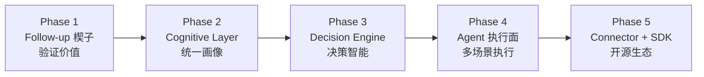

# 03 · 路线图与当下进展

> 我们的路线不是「做一个更好的 FSM」，也不是「先造 Agent Runtime 再开源 Kernel」。
>
> **路径**：Follow-up 验证业务价值 → 建立 Cognitive Layer → Decision Engine → Agent 化执行 → 开放 Connector + SDK。

工程仓库与包名仍为 **fs-aol**；路线图阶段编号 **Phase 1–5** 与早期文档中的 Stage 0–3 对照见文末。

---

## 核心判断：路径修正

```text
旧（危险）:
  Follow-up Agent → AOL Runtime → AOL Kernel → Open Source Kernel

新（推荐）:
  Phase 1  Follow-up Agent        验证业务价值
  Phase 2  Cognitive Layer      统一画像与认知图谱
  Phase 3  Decision Engine      「下一步应该做什么」
  Phase 4  Agent 化执行           手脚层扩展
  Phase 5  Connector + SDK 开源   生态，不开放认知核心
```

> **不能一开始平台化，更不能先开源 Kernel。** 必须先赢一个「闭环业务指标 + 可沉淀认知」。



---

## Phase 1 · Follow-up Skill（现在 ~ 3 个月）

**目标**：用跟进行为 **Skill** 验证业务价值，并跑通《认知机器》最小竖切：

```text
Business Systems → Harness（enrich）→ Cognitive（建议）→ Trusted Execution（审批+执行+审计）
```

产品界面可仍称 Follow-up Agent。

> 对应早期 **Stage 0**；产品退出 KPI 不变：管家在 **Console** 内看见并处置建议，App 内处置率 ≥70%。

### 核心建设

**1. FSM 接入（只读事实）**

- 工单状态可追踪；领域语义边界清晰（[PUB-04](PUB-04-domain-semantics.md)）。
- FSM 保持 **commodity**，不堆业务逻辑。

**2. Follow-up（第一个决策楔子）**

```text
事件/停滞工单 → enrich 认知上下文 → 决策 JSON（情况判断 + 跟进方案）
  → 人工审批 → 企微/追踪库执行
```

**3. Event Schema 雏形（为 Phase 5 开源铺路）**

统一命名：`QuoteSent` · `CustomerSilent` · `JobCompleted` …  
**注意**：Schema 与 Connector 可开源；**认知与决策规则不先开源**。

**4. Human-in-the-loop（必须）**

`Suggestion` → Approve / Reject / Modify → `Action`。

> 版本线：POC `poc-followup` → `v0.2.x` Console → **v0.3** 运营纪律 + UX；产品轨见 [PUB-05-releases.md](PUB-05-releases.md)。

---

## Phase 2 · Harness + Cognitive Layer（3 ~ 9 个月）

**目标**：

1. **Business Harness 产品化**：可复用的 `Project Context` 组装（客户/项目/时间线/销售），多 Skill 共享。
2. **Cognitive Layer 加厚**：统一画像、Cognitive Graph、Business Memory。

> 对应早期 Stage 1「Context Layer」，但 Harness 与 Cognitive **分责**：组装 vs 理解/决策。

### 关键模块

- Harness：跨源上下文模板、查证轨在 Console 可见（S3）。
- Cognitive：客户/项目画像、行业 Ontology 可查询。
- Trusted Execution：outcome 与审计轨支撑 ROI（S4）。

> 产品轨：v1.1 trust → v1.2 proof → 多 Skill 共享同一 Harness/Cognitive。

**明确不做为主目标**：通用 Agent Runtime 品牌。

---

## Phase 3 · Decision Engine（9 ~ 18 个月）

**目标**：系统化回答 **「下一步应该做什么」**——优先级、时机、策略、风险、置信度。

> 对应早期 **Stage 2** 的 Decision Layer；**不是**先堆 Workflow Marketplace。

### 关键模块

- 可解释决策输出（与 Action Spec 协议对齐）。
- 规则链 + 模型推理混合；SOP 与 [sops/](../../sops/README.md) 沉淀为决策资产。
- ROI 看板：决策覆盖率、采纳率、转化 uplift、override 率。

> 产品轨：Studio 配置规则/SOP（非工程人员可配）→ 自托管。

---

## Phase 4 · 更多 Skill（与 Phase 3 部分重叠）

**目标**：在 Harness / Cognitive / Trusted Execution 稳定后，接入 Estimate、Qualification 等 **Skill**。

- 新 Skill **只**增加领域提示与策略映射，**复用** Harness + Cognitive + Trusted Execution。
- Workflow/Runtime 按需引入——基础设施，非品牌核心。

---

## Phase 5 · 开放 Connector + SDK（18 个月 +）

**目标**：生态扩张，**不开放认知与决策护城河**。

| 层 | 开源 | 闭源 / 商业 |
|----|------|-------------|
| **Connector**（Excel / Sheets / QuickBooks / FSM） | ✅ | — |
| **Event Schema** | ✅ | — |
| **Agent SDK** | ✅ | — |
| **Cognitive Graph + Ontology + Decision** | ❌ | ✅ 核心资产 |
| **Hosted FS-COS** | — | ✅ SaaS / 行业 Pack |

**不做终局叙事**：Agent Marketplace 作为公司核心价值（Agent 本身会越来越便宜）。

### 终局形态

```text
Field Service Cognitive Operating System（FS-COS）
= System of Cognition for SMB field service
```

---

## 与早期 Stage 0–3 对照

| 早期 Stage | 新 Phase | 叙事变化 |
|------------|----------|----------|
| Stage 0 闭环系统 | **Phase 1** | 强调业务价值验证，而非 Runtime |
| Stage 1 Agent Runtime | **Phase 2** Cognitive Layer | Runtime 降为执行基础设施 |
| Stage 2 AOL Core | **Phase 3–4** Decision + Agent 执行 | Kernel/Event Bus 非品牌核心 |
| Stage 3 开源生态 | **Phase 5** Connector + SDK | 不先开源 Kernel |

---

## 最重要的战略判断

1. **不要把自己定义为 Agent Operating Layer**——Runtime / Workflow / Marketplace 易被平台原生化。
2. **必须先赢闭环业务指标**（follow-up 转化、Console 采纳率），并沉淀**可复用认知与决策**。
3. **FSM 商品化**；**认知与决策资产化**。
4. **开源连接层与协议，闭源认知与决策智能**。

### 一句话定位

> **FSM is the system of record. FS-COS is the system of cognition and decision.
> Agents execute what humans approve.**

---

## 当下进展（Phase 1 · POC）

POC 引擎与 Console 已落地。详见根 `README.md` 与 [PUB-05-releases.md](PUB-05-releases.md)。

| 能力 | 状态 |
|------|------|
| DB 增量轮询（XLink 206 待签约停滞） | ✅ 生产只读 |
| 幂等水位线 + Turso 追踪 | ✅ |
| enrich + v0.2 结构化建议 | ✅ |
| 企微卡片 + Console 审批 | ✅ DRY-RUN / 试点 |
| GHA + Cloudflare Worker 调度 | ✅ |
| Turso `state_at` 迁移修复 | ✅（2026-06） |

### 下一步（Phase 1 内）

1. v0.3 运营纪律（run_summary、runbook、7 日 cron）+ UX wow。
2. 沉淀 **Event Schema** 文档与命名（为 Phase 5 开源准备）。
3. 记录采纳率 / 转化等闭环指标。
4. 巩固领域语义 seam（[PUB-04](PUB-04-domain-semantics.md)）。
5. SOP 喂给推理（v0.4+），为 Phase 2–3 认知/决策资产铺路。

### 已知待增强

- 工单 `describe` 稀疏 → 需 workflowNode 等补全（`PRIV-xlink-data.md`）。
- 阻塞类型等上下文先采集再分类。
- Worker / PAT 运维：使用长期 `for-outside-scheduler` PAT，非临时 `gh auth token`。

---

## 架构文档

认知优先的系统图与模块定义见 [PUB-02-architecture.md](PUB-02-architecture.md)。

> **产品化纪律**：每 Phase 以可感知 KPI 退出；产品脊柱见 [PUB-07-product-surface.md](PUB-07-product-surface.md)；版本见 [PUB-05-releases.md](PUB-05-releases.md)。
