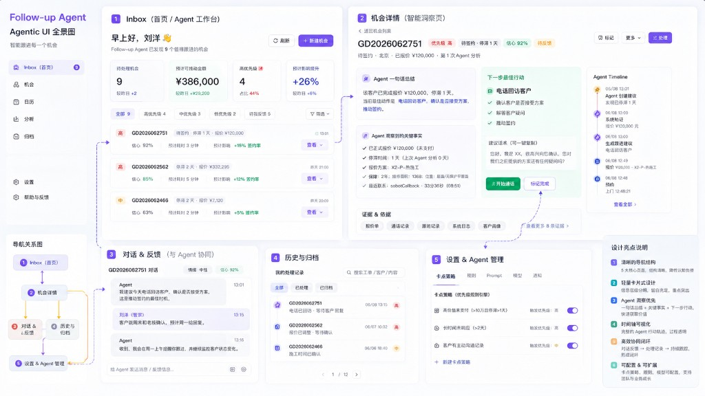

# 15 · Agentic UI 视觉与框架（UX 设计稿 SSOT）

> **状态**：v0.3.0 视觉规范  
> **配套**：[PUB-14-v030-scope.md](PUB-14-v030-scope.md) §5.2 · [PUB-07-product-surface.md](PUB-07-product-surface.md)  
> **设计稿**：（`docs/assets/agentic-ui-panorama.png`）

---

## 1. 设计稿一句话

**浅色卡片工作台 + 紫色 Agent 品牌 + 左侧固定导航**，首页聚合指标与队列，案件页突出 **Agent 洞察（紫）** 与 **Next Best Action（绿）**，右侧 **Agent 时间轴** 透明展示推理与业务事件。

---

## 2. 色彩体系（实现 Token）

> 工程落点：`apps/console/app/globals.css`（`:root` CSS 变量）+ Tailwind semantic classes。  
> **v0.3 切换为浅色主题**（废弃桌面强制 `dark`）。

| 角色 | 用途 | 参考色 | CSS 变量（建议） |
|------|------|--------|------------------|
| **Brand / Primary** | 主按钮、侧栏激活、Agent 图标/摘要框边框 | 鲜紫 `#7C3AED`（violet-600） | `--primary` |
| **Primary subtle** | 侧栏激活背景、Agent 摘要浅底 | 淡紫 `#EDE9FE`（violet-100） | `--agent-surface` |
| **Background** | 页面底 | `#F8FAFC`（slate-50） | `--background` |
| **Card** | 卡片、面板 | `#FFFFFF` | `--card` |
| **Foreground** | 标题 | `#0F172A`（slate-900） | `--foreground` |
| **Muted** | 元数据、副文案 | `#64748B`（slate-500） | `--muted-foreground` |
| **Border** | 卡片描边 | `#E2E8F0`（slate-200） | `--border` |
| **Success / Action** | 「开始执行」、主行动 CTA | 翠绿 `#10B981`（emerald-500） | `--success` |
| **Danger / High** | 高优先级 Tag、滞留告警 | 珊瑚 `#EF4444`（red-500） | `--destructive` |
| **Warning / Medium** | 中优先级 | 琥珀 `#F59E0B` | `--warning` |
| **Agent accent** | Run 步骤、时间轴 Agent 节点 | 紫 + 浅紫渐变 | `--agent-accent` |

### 优先级 Tag（与业务一致）

| 优先级 | 背景 | 文字 |
|--------|------|------|
| 高 | `bg-red-50` / `text-red-700` | 设计稿红色「高」 |
| 中 | `bg-amber-50` / `text-amber-800` | |
| 低 | `bg-slate-100` / `text-slate-600` | |

### Agent 专属块

- **Agent 摘要卡**：`border-violet-200 bg-violet-50/80`，左侧或顶部紫色竖条
- **Next Best Action 卡**：`border-emerald-200 bg-emerald-50/60`，主按钮 `bg-emerald-600 hover:bg-emerald-700`

---

## 3. 布局框架（App Shell）

```text
┌──────────┬────────────────────────────────────────────────────────┐
│ Sidebar  │  Main（max-w 无硬封顶，padding 24px，gap 16–24px）        │
│ 240px    │  ┌─ Page Header（问候 + 摘要 + 操作按钮）────────────┐  │
│ fixed    │  ├─ Metric Cards（grid 4 列 → sm 2 列）──────────────┤  │
│          │  ├─ Filter Tabs（药丸 Tab + 计数）───────────────────┤  │
│          │  └─ Content（列表 / 双栏案件 / Feed）────────────────┘  │
└──────────┴────────────────────────────────────────────────────────┘
```

| 参数 | 值 |
|------|-----|
| 侧栏宽度 | `240px`（`w-60`），`border-r`，白底 |
| 主区最小高度 | `min-h-screen` |
| 卡片圆角 | `rounded-xl`（`--radius: 0.75rem`） |
| 卡片阴影 | 轻阴影 `shadow-sm`，hover 列表行 `shadow-md` |
| 间距节奏 | 区块 `gap-6`；卡内 `p-4`～`p-6` |

### 侧栏导航（设计稿 → 路由映射）

| 设计稿 | 图标语义 | v0.3 路由 | 说明 |
|--------|----------|-----------|------|
| **首页 / Inbox** | 收件箱 | `/` `?tab=active` | 主工作台；徽章 = 待处置数 |
| **机会** | 漏斗 | `/` `?tab=active` | v0.3 与首页同数据；后续可拆筛选 |
| **日历** | 日历 | — | **占位禁用**（v0.4+） |
| **分析** | 图表 | `/` 顶部指标区 | v0.3 用 Workbench 四卡指标，无独立页 |
| **归档** | 文件夹 | `/` `?tab=archived` | 含 closed + archived |
| **设置** | 齿轮 | 侧栏底 | v0.3 仅链接 env/帮助；**策略开关属 v0.4 Studio** |
| **帮助与反馈** | ? | 外链或文档 | 侧栏底 |

---

## 4. 页面 ↔ 设计稿面板

### 4.1 首页 · Agent Workbench（设计稿 Panel 1）

| 设计稿元素 | 实现 |
|------------|------|
| 「早上好，{管家名} 👋」 | `page.tsx` header，试点管家名来自 filter/cookie |
| 四张指标卡 | 待处置数、高优先级数、阻塞待采集、已跟进（Turso `computeStats` + 扩展） |
| 筛选 Tab | 全 / 高 / 中 / 低 / 待反馈 → 映射 `InboxTabs` + 优先级 filter |
| 机会列表行 | `SuggestionInboxTable` 演进：优先级 Tag、工单号、滞留、**置信度/影响**（v0.3 用已有字段：优先级、滞留、needs_follow_up） |
| 「刷新」「+ 新建机会」 | 刷新 = `router.refresh`；新建 **不做**（非楔子范围） |

### 4.2 案件页 · Smart Insight（设计稿 Panel 2）

| 设计稿区域 | 实现 |
|------------|------|
| 顶栏面包屑 + ID + 状态 Tag | 工单号、事件类型、优先级、滞留、归档条 |
| **Agent 摘要（紫框）** | 建议 `原因摘要` + 一行 Agent 结论 |
| **关键事实清单** | enrich 查证字段 checklist（报价/签约/停留） |
| **Next Best Action（绿框）** | `主行动` + `沟通要点`；CTA = 同意 / 已跟进（绿主按钮） |
| **证据与依据 Tab** | 报价 / 通话 / 跟进 / 系统日志 → 映射 trace 证据 + timeline 节点 |
| **右侧 Agent 时间轴** | `PlanTimelineSection` 窄栏固定；业务 + Agent lane |

布局：**双栏 + 右栏时间轴（约 280px）**，与 PUB-14 Case Workspace 一致。

### 4.3 对话与反馈（设计稿 Panel 3）

| 设计稿 | v0.3 口径 |
|--------|-----------|
| Agent ↔ 管家聊天 | **不做自由对话**；用 **处置 + 阻塞回填 + 修改建议** 作为结构化反馈 |
| 底部输入框 | v0.3 仅「修改建议」Dialog + 阻塞表单；v0.4 再评估协作线程 |

### 4.4 历史与归档（设计稿 Panel 4）

合并进首页 `?tab=closed` / `?tab=archived` + 搜索（v0.3 可选工单号筛选）。

### 4.5 设置与 Agent 管理（设计稿 Panel 5）

**v0.3 不交付**完整策略开关页；侧栏保留入口占位，正文链到 runbook / PO 文档。`卡点策略 / Prompt / Model` 属 **v0.4 Studio**。

---

## 5. 组件清单（按设计稿）

| 组件 | 说明 | Tag |
|------|------|-----|
| `AppShell` | 侧栏 + 主区 slot | `v0.3.1` |
| `WorkbenchMetrics` | 四卡指标 + trend 占位 | `v0.3.1` |
| `WorkbenchFilters` | 药丸 Tab + 计数 | `v0.3.1` |
| `OpportunityRow` | 列表行（Tag + 元数据 + View） | `v0.3.1` |
| `AgentSummaryCard` | 紫色摘要 | `v0.3.2` |
| `NextActionCard` | 绿色主行动 + 脚本复制 | `v0.3.2` |
| `EvidenceTabs` | 证据 Tab 组 | `v0.3.2` |
| `AgentTimelineRail` | 右侧竖向时间轴 | `v0.3.2` / `v0.3.3` |
| `ToolStepCard` | Run 内单步工具卡 | `v0.3.2` |
| `DispositionBar` | sticky 人在回路 | `v0.3.2` |
| `EmptyState` / `ErrorBoundary` | 工业级空错态 | `v0.3.4` |

---

## 6. 与现状差异（改造要点）

| 现状 | 设计稿要求 |
|------|------------|
| `layout.tsx` 强制 `dark` | 改 **浅色** + 紫色 primary（`globals.css`） |
| 无侧栏，居中 `max-w-7xl` | **AppShell 侧栏 + 全宽主区** |
| 详情 `max-w-4xl` 单栏 + Tab | **双栏 + 右时间轴**，减少 Tab 切换 |
| 移动 `/m` 独立 light 主题 | 与桌面 **同一 token**（紫/绿语义保留） |

---

## 7. 参见

- [PUB-14-v030-scope.md](PUB-14-v030-scope.md) — 交付波次与验收  
- `apps/console/app/globals.css` — Token 实现  
- `apps/console/components.json` — shadcn base-nova
